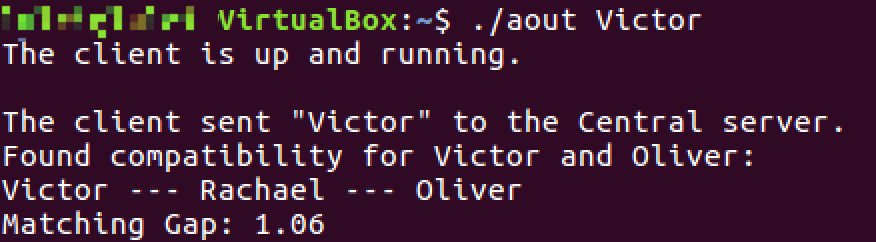
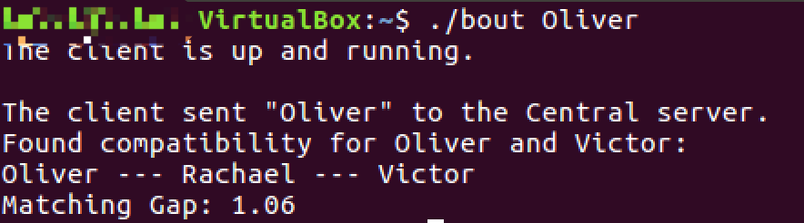
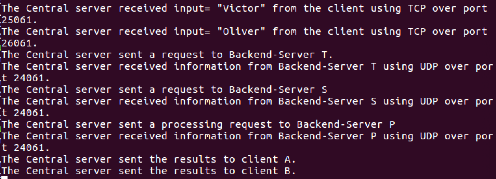
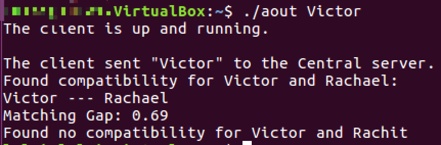
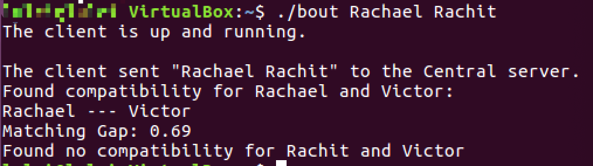
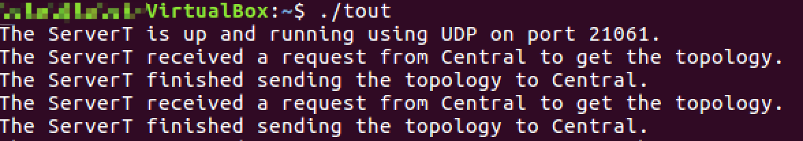
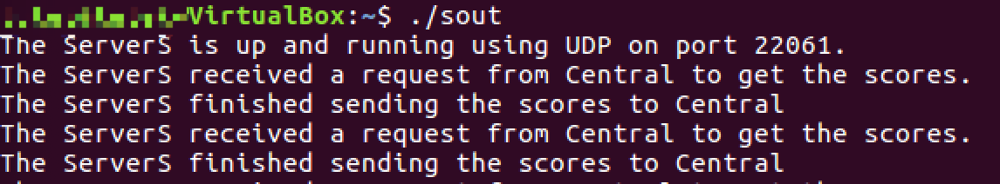
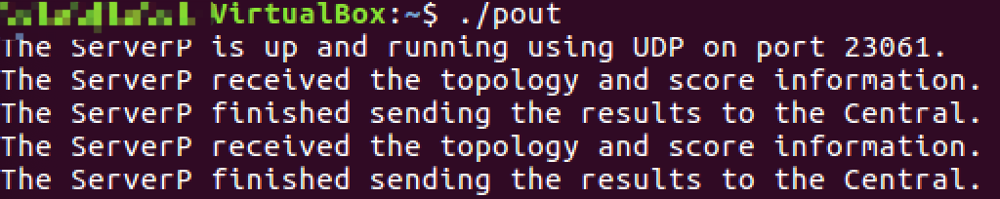

# Socket Project

## Background
Social networks are nowadays in every moment of our lives. The information built upon interactions among people has led to different types of applications. Crowdsourced apps such as Uber, Lyft, Waze use information for navigation purposes. Other apps
such as dating apps provide matching algorithms to connect users who share similar behaviours and increase their compatibility chances for future success. In this project we shall implement a simplified version of a matching app that'll help us understand how matching systems work in the real world. Specifically, you'll be given a network topology consisting of social connections between different users in the network. This will consist of nodes representing users and the edges between them. Beside social network topology, you will also be given a database consisting of compatibility test scores. This database will be in plain text and consist of multiple key (the user), value (the corresponding score) pairs.

## Brief Explanation
There are two clients and four servers in the model. The topo is as follows:

### Phase 1
#### Phase 1A
**Establish the connections between the Clients and Central Server.**

The steps on the clint side are 
*1)socket(); 2)sockaddr_in information 3)connect(); 4)send(); 5)recv();*

The steps on the central side are 
*1)socket(); 2)sockaddr_in information for both TCP and UDP; 3)bind();*
*4)accept() only for TCP; 5)child sockaddr_in information only for TCP;*
*6)recv(); 7)send();*

**Note**: For clientB, there may exist TWO input names, so send "Nname1+name2" to central, where N represents the number 
of names and '+' distingish two names.

#### Phase 1B
**Establish the connections between Server C and all other backend servers.**

In Central, when receiving information from clients, the central Combine two pieces of information into one piece of information as "name1+name2+name3"(if name3 exists) or "name1+name2", where '+' distingish two names.

### Phase 2
**Central contact server T and server S to retrieve related data and then send data to server P to compute the final results.**

All of these steps in phase 2 are based on UDP. Central sends clients' names to server T first to get the edgelist. After getting the edgelist, Central send edgelist to server P. Then Central sends clients' names to server S to get the scores. After getting the edgelist, Central send edgelist to server P. Finally, Central sends clients' names to server P to compute the smallest compatibility gap.

The data form sending by server T is "name1+name2\*". '+' connects two adjacent edges and '\*' means one edge ends and another edge starts. The data form sending by server S is "name1+score\*\". '+' connects the node's name and its score. '\*' means an end of a node. 

After receiving all the data, server P start compute. Firstly, server P decode edgelist data and build a graph by adjacent list. Secondly, server P decode scores data and calculate each edge's value in the adjacent list. Third, server P uses **Dijkstra** to get the smallest compatibility gap. 

The data sending by server P is "BBBscores1\*edge1+edge2+#scores2\*edgei+edgej+". "BBB" are three flag bits. The first 'B' indicates if the first path(from name1 to name2) is valid or not, '$' representing valid and '@' representing invalid. The second 'B' indicates the number of paths, 'W' for no path, 'N' for one path and 'Y' for two paths. The third 'B' indicates if the second path(from name1 to name3) is valid or not, '$' representing valid and '@' representing invalid. If one path does not exist, say the first path, the data form will change to "@BBname1+name2", which means "No such a path from name1 to name2". "score*edgei+edgej" means the compatibility of this path is score and the minimum path goes from edgei to edgej to edgek and so on. ‘#’ distingish two paths.

### Phase 3
**Central send back the results to both client.**

The central will send the data receiving from server P to both clients directly. The clients need to decode the data. By using the rule in phase 2, client will know if the path exist or not and if yes, what the value and edges of the minimum path are.

### Phase 4
**ClientB may have two input names**

Just as said above, all the processes are finished successfully under this condition. 

## Examples
### Example #1: ClientA sends ONE name and ClinetB sends ONE name.
The graph is as follows:

**Firstly**, booting up central server, server T, server S, server P. Then, say, cleint A sends "Victor" to Central and client B sends "Oliver" to central. 

  Client A prints a message: 
*The client sent "Victor" to the Central server.* in this step.

  Client B prints a message:
*The client sent "Oliver" to the Central server.* in this step.

**Secondly**, the central receives the two names, integrate them into a name char array(which is "Victor+Oliver" is this case), send this char array to server T, server S in turn. Server T will encode the graph and then send the topology to the Central(The topology data is "Rachael+Victor\*Rachael+King\*Rachael+Oliver\*Victor+King\*Rachit+Hanieh\*" in this case). Server S will encode the scores and then send the scores to de Central(The scroes data is "Rachael+43\*King+3\*Oliver+94\*Victor+8\*Rachit+129\*Hanieh+49\*" in this case). After receiving the topology and scores, the Central will relay these data to Server P and again send the name char memtioned above to Server P. Server P will run a Dijkstra and get the results, encode the result and then send the result data to the Central. The result data in this condition is "$N$1.06\*Oliver+Rachael+Victor+#". Again, according to the encoding rules in Brief Explanation, the hearder of result data "$N$" means that the server requests only for one path and this path exists.

**Thirdly**, the Central receives the result data from Server P, and sends the data back to both clients using TCP. The clients receives the result then decode the result with the protocol above, finnaly print the result. 

From the result we can see that, the smallest matching gap between "Victor" and "Oliver" is 1.06, and the shortest path is "Victor -> Rachael -> Oliver".

### Example #2: ClientA sends ONE name and ClinetB sends TWO names.
Very similar to Example #1. But in this case, Client B sends TWO names to the Central, which are "Rachael" and "Rachit", as shown below.

The result getting from Server P is "$Y@0.69\*Rachael+Victor+#Victor+Rachit+". The header "$Y@" means the Central requests for TWO paths but only the first path exists.

The example result of Central, ServerT, ServerS, ServerP are as follows:

Note that we can see FOUR lines in ServerT, ServerS and ServerP because I did example #1 and example #2 continously. So the first half belongs to example #1 and the second half belongs to example #2.

From the result we can see that: 
1. There exists paths between "Victor" and "Rachael". The smallest matching gap between "Victor" and "Rachael" is 0.69 and the shortest path is "Victor -> Rachael".
2. There doesn't exist a path between "Victor" and "Rachit".

## Improvements
### No1. Deal with big graph.
For big graph, server T and server S will create a huge datagram, which may exceed the transmission limit of UDP. So I cut all udp datagrams necessarily to force the length of each datagram to not exceed 1000 bits. In this case, in all servers, when transmitting datagrams, the sender will firstly send a small message to the receiver, which only contains the number of small datagrams, to let the receiver know how many datagrams will be received next. Then the sender sends each small datagram one by one.

### No2. Deal with wrong input
Both clients may enter non-existent nodes, typos or deliberately. To deal with this condistion, in servers, especially ServerP, before running Dijkstra, a wrong-input detection is necessary. If it is detected that the node does not exist, then the result can be returned directly without further calculation.

## To Be Completed
### Deal with UDP unordered data and data loss
During UDP transmission, orderly transmission is not guaranteed. So we need to artificially add some protocols to ensure the transmission order of UDP. My initial idea is to add a header and a tailer to each datagram after the UDP segmentation. Label each UDP datagram in the header, and record the header-label that should be received next in the tailor(very similar to ACK in TCP). 

### Cut TCP segments
TCP segments may also have a big-size situation, if not dealt with, it will easily cause network congestion. But I tried it, it can’t use the same method as UDP segmentation. My preliminary judgment is that this may be caused by the TCP mechanism. Sending multiple times in a short period of time, TCP will be confused and drop the following segments. My initial solution is to set a time delay between sending different segments.

### Deal with malicious input
After studying network security, I realized that as a complete system, we must have corresponding countermeasures against all possible network attacks. In the follow-up, I will do some stress tests to verify the reliability of the system and implement methods to deal with basic internet attacks.

### Time saving
Do filtering in Server T&S&P.

## References
1. UNIX IN A NUTSHELL, Arnold Robbins, O'Reilly Ed., 4th edition, 2005, ISBN 0­596­10029­9;
2. Beej’s Guide to C Programming For Beginners, Brian “Beej Jorgensen” Hall, v0.6.12, Copyright © July 27, 2021;
3. Beej’s Guide to Network Programming Using Internet Sockets, Brian “Beej Jorgensen” Hall, v3.1.5, Copyright © November 20, 2020;